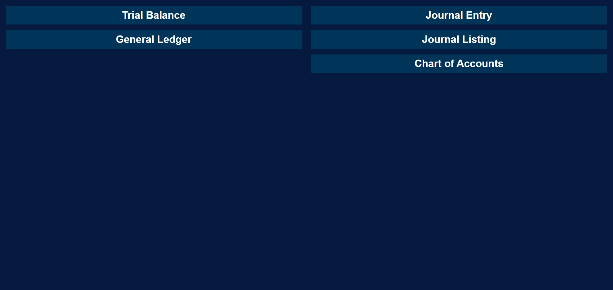

# Openbooks
**[Openbooks](https://chris-karagiannis.github.io/Openbooks/)** is a basic accounting program that allows for journal entries to be posted, and changes reflected in reports. These reports can be filtered by date ranges and export reports to Excel.

## Motivation
In my career as an accountant, I have had a lot of exposure to accounting/bookkeeping programs, so I decided as a project to create a simple one

## How to use
### Making, saving and opening a file
| New             | Open               | Save                       | Save As |
| ------          | ------             | ------                     | ------- |
| Create new file | Open existing file | Save currently opened file | Save a copy of currently opened file|

### The Workspace
Once a file is made or opened, the workspace will open. The workspace is where journal entries can be entered, accounts added and reports generated. Each part of the workspace can be shown and hidden by clicking the respective heading 
 

#### Chart of Accounts
The chart of accounts shows the current accounts within the file and allows for more accounts to be created
##### Creating new accounts
1. Navigate to the "Chart of Accounts" and click the heading if not already open
2. Type a name into the input box and click "Add" button. The account will not be added if an account with the same name already exists

#### Journal Entry
##### Posting journal entries
1. Navigate to the "Journal Entry" and click the heading if not already open
2. Select the date of the journal (the journal will not post if no date is entered)
3. Add a narration
4. For each line, select the account from the dropdown you would like to post to, then the debit or credit value needing to be posted to the account. 
    - Lines can be added clicking the "Add line" button and deleted by clicking the "X" button on the end of the line
5. Once all the lines of the journal have been added and the total debits match the total credits, click "Post" button to post the journal

#### Reports
##### Trial Balance
##### General Ledger
##### Journal Listing